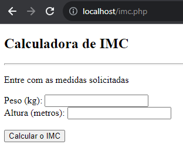

# :iphone: Calcluladora IMC
Atividade de Cálculo do IMC (+praTi - Introdução a Programação)

Atividade onde fora criada uma calculadora de IMC (Indice de massa corporal), onde é feita introdução com os valores de Peso (Kg) e Altura (m) nos campos pertinentes e como resoltado ao clicar no botão "Calcular o IMC" o programa retorna com o valor obtido do cálculo, juntamente com alguma das seguintes informações: 
* Você está Abaixo do Peso Normal, para o IMC abaixo de 18.5
* Seu peso está dentro do Peso Normal, para IMC entre 18.5 e 24.9
* Você está com Excesso de peso, para IMC entre 25 e 29.9
* Você está com Obesidade Grau 1, para IMC entre 30 e 34.9
* Você está com Obesidade Grau 2, para IMC entre 35 e 39.9
* Você está com Obesidade Grau 3 (Obesidade Mórbida), para IMC superior a 40

## :pencil: Licença
Esse projeto está sob licença. Veja o arquivo [LICENÇA](LICENSE.md) para mais detalhes.
